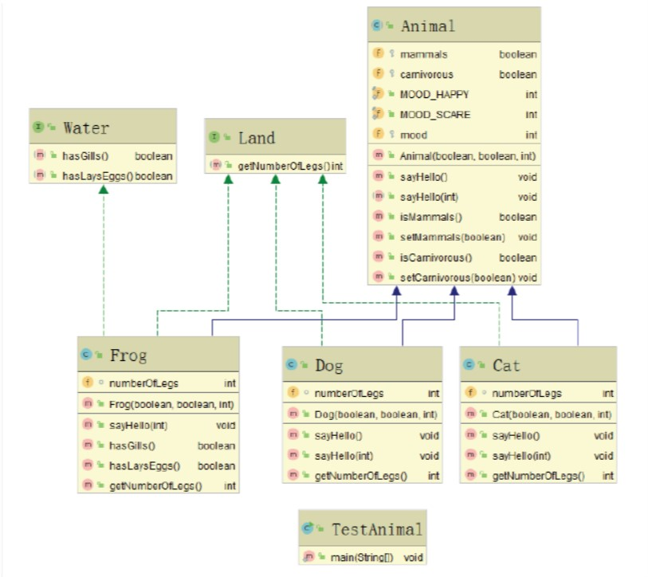

# Object-Oriented-Assignment

## Overview

JavaObjectAnalyzer is a powerful tool designed to simplify the analysis of Java programs by utilizing natural language processing techniques. The tool aids in identifying objects, extracting attributes and methods, and generating class structure diagrams for a comprehensive understanding of Java code architecture.

## Getting Started

### Clone the Repository

```bash
git clone https://github.com/efros5566/Object-Oriented-Assignment.git
```

### Navigate to the Project Directory
```
cd Object-Oriented-Assignment
```
### Run the JavaObjectAnalyzer Tool
```
java -jar Object-Oriented-Assignment.jar D:\Users\User\Desktop\Object Oriented Assignment
```
## Analysis Steps
### Identify Objects:

1. Utilize the "Object-noun" linguistic pattern to recognize objects in the Java code.
Extract Attributes and Methods:

2. Extract attributes (adjectives) and methods (verbs) from identified objects.
Analyze Class Relationships:

3. Determine relationships, focusing on "Yes" (inheritance) and "Have" (attributes) relationships.
Generate Class Structure Diagram:

4. Utilize the extracted information to draw a visually appealing class structure diagram.

## Class Structure in Detail

The class structure generated by JavaObjectAnalyzer provides a detailed representation of the relationships and hierarchies within the Java code.
This section elaborates on various aspects of the class structure:

### Inheritance Relationships:

In the class structure diagram, you'll find a visual representation of inheritance relationships between classes. If a class A inherits from class B,
it indicates that class A is a specialized version of class B. The arrows in the diagram depict the direction of inheritance,
highlighting the flow of characteristics from the parent class to its subclasses.

```java
public class Dog extends Animal {
    // ...
}
```
## Class Hierarchy
The project includes an abstract class, Animal, which serves as a foundational structure for deriving more specific animal classes. This abstraction allows for a clean and organized representation of different animal types. Below are examples of classes that inherit from the abstract class Animal:
### Classes
```java
public abstract class Animal {
    // Common attributes and methods for all animals
    // ...
}
```
```java
public class Dog extends Animal {
    // Specific attributes and methods for dogs
    // ...
}
```
```java
public class Cat extends Animal {
    // Specific attributes and methods for cats
    // ...
}
```
```java
public class Frog extends Animal {
    // Specific attributes and methods for frogs
    // ...
}
```
By utilizing an abstract class, shared characteristics among animals can be encapsulated, promoting code reusability and a consistent design.

### Interfaces
In addition to the abstract class, JavaObjectAnalyzer incorporates interfaces to extend the capabilities of the animal classes. Each class implements the relevant interfaces, defining specific behaviors that enhance the overall functionality of the system. Here's an example of how interfaces are integrated:

```java
public interface Land {
    int numberOfLegs();
}
```
```java
public interface Water {
    boolean hasGills();
    //...
}
```
```java
public class Dog extends Animal implements Land, Water {
    // Implementing methods from Land and Water interfaces
    // ...
}
```
In this example, the Dog class, which extends Animal, implements the Land and Water interfaces. This allows for a modular approach to functionality on their specific implementations.


### Example Usage
```java
public class Main {
    public static void main(String[] args) {
        Dog myDog = new Dog();
        Cat myCat = new Cat();

        myDog.sayHello();  // Dogs can make sounds
        myCat.sayHello();       // Cats can make sounds
    }
}
```
In this example, the program demonstrates the usage of specific animal instances, showcasing the unique features implemented by each class.



